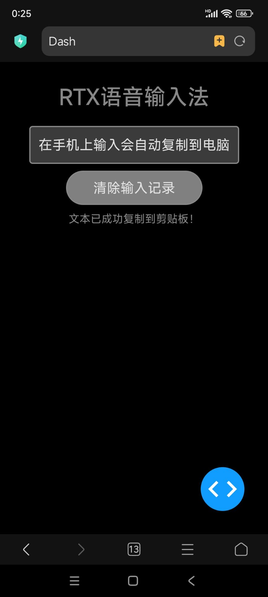

# 既然Linux的语音输入法不好用，那我为什么不直接用手机的输入法呢？



# 安装

直接安装即可，或者创建虚拟环境安装

```
pip install streamlit
pip install pyperclip
pip install dash
```

# 运行

运行以下命令即可自动打开网页：

```
streamlit run rtx_im2.py
```

为了使运行更加流畅，你也可以直接运行基于dash的版本

```
python rtx3-pro.py
```

之后我们在手机上通过ip+端口访问网页，即可在手机上完成输入

输入的内容会自动复制到电脑的剪贴板中，直接粘贴即可
